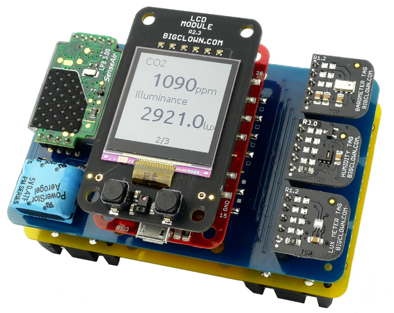
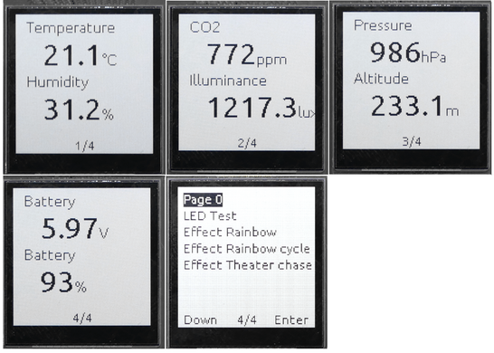

<a href="https://www.bigclown.com/"></a>

# Firmware for BigClown Generic Node

[](https://travis-ci.org/bigclownlabs/bcf-generic-node)
[](https://github.com/bigclownlabs/bcf-generic-node/releases)
[](https://github.com/bigclownlabs/bcf-generic-node/blob/master/LICENSE)
[](https://twitter.com/BigClownLabs)

This repository contains firmware for BigClown Generic Node.



## Firmware Programming

You need to install [BigClown Toolchain](https://www.bigclown.com/doc/tutorials/toolchain-setup/) with [BigClown Firmware Tool](https://www.bigclown.com/doc/tutorials/toolchain-guide/)

  * Programming firmware for generic nodes:
    ```
    bcf flash --dfu bigclownlabs/bcf-generic-node-battery-mini:latest
    bcf flash --dfu bigclownlabs/bcf-generic-node-battery-standard:latest
    bcf flash --dfu bigclownlabs/bcf-generic-node-power-module-rgb150:latest
    bcf flash --dfu bigclownlabs/bcf-generic-node-power-module-rgb300:latest
    bcf flash --dfu bigclownlabs/bcf-generic-node-power-module-rgbw144:latest
    bcf flash --dfu bigclownlabs/bcf-generic-node-power-module-rgbw72:latest
    ```

    Note: Different variants of FW are optimized according to the power supply source: battery-mini: 2 x AA, battery-standard: 4 x AAA, node-power = 5 V DC Jack or 5 V USB.
    You can also chose type and length of digital LED strip connected to Power Module.

Programming firmware for USB gateway:

  * Core Module:
    ```
    bcf flash --dfu bigclownlabs/bcf-gateway-core-module:latest
    ```

  * USB Dongle:
    ```
    bcf flash bigclownlabs/bcf-teway-usb-dongle:latest --device "device_name"
    ```

    Example of device_name in Linux:

    ```
    /dev/ttyUSB0
    ```
    Example of device_name in Windows:

    ```
    COM1
    ```


## Values showed on LCD Module

Show values of connected sensors and battery voltage (if Battery Module or Mini Battery Module is connected). Can be used also for chosing basic effect of LED strip (if Power Module is connected). Use left or right button on LCD Module to browse the menu.



| Value                          | Unit   | Suported modules (sensors)                                                                                  |
|--------------------------------|--------|-------------------------------------------------------------------------------------------------------------|
| temperature                    | °C     | Temperature Tag or Climate Module (both higher priority) and  TMP112 sensor at Core Module (lower priority) |
| relative humidity              | %      | Humidity Tag R1.x (HTS221), R2.x (HDC2080), R3.x (SHT20) and Climate module (SHT20)                         |
| CO2 concentration              | ppm    | CO2 Module                                                                                                  |
| light intensity                | lux    | Lux Meter Tag and Climate Module                                                                            |
| atmospheric preasure, altitude | hPa, m | Barometer Tag and Climate Module                                                                            |
| battery voltage and capacity   | V, %   | Battery Module and Mini Battery module                                                                      |
| LED effect setting             | NA     | Power Module                                                                                                |

## Supported modules and reading values from sensors
MQTT Commands can be sent only from paired gateway. Use Core Module or USB Dongle with [gateway firmware](https://github.com/bigclownlabs/bcf-gateway) connected to Raspberry Pi with installed [BigClown Raspbian image](https://www.bigclown.com/doc/tutorials/raspberry-pi-installation/) or Computer with installed [BigClown Playground](https://www.bigclown.com/doc/tutorials/playground-setup/).

#### Read values from sensors using MQTT subscribe:
  * Subscribe to read all MQTT topics:
    ```
    mosquitto_sub -v -t '#'
    ```
#### Periodic update values:

| Module              | Value                          | Unit   | Update interval  | Transmit periode      |
|---------------------|--------------------------------|--------|------------------|-----------------------|
| Temperature Tag     | temperature                    | °C     | 1 s              | 5 min or delta 0.1°C  |
| Humidity Tag        | relative humidity              | %      | 1 s              | 5 min or delta 1%     |
| CO2 Module          | CO2 concentration              | ppm    | 50 s or 15 s (1) | 5 min or delta 50 ppm |
| Lux Meter Tag       | light intensity                | lux    | 1 s              | 5 min or delta 5 lux  |
| Barometer Tag       | atmospheric preasure, altitude | hPa, m | 1 s              | 5 min or delta 10 hPa |
| Battery Module      | battery voltage and capacity   | V, %   | 1 s              | 60 min                |
| Mini Battery Module | battery voltage and capacity   | V, %   | 1 s              | 60 min                |
| Climate Module      | temperature                    | °C     | 1 s              | 5 min or delta 0.1°C  |
|                     | relative humidity              | %      | 1 s              | 5 min or delta 1%     |
|                     | light intensity                | lux    | 1 s              |  5 min or delta 5 lux |
|                     | atmospheric preasure, altitude | hPa, m | 1 s              | 5 min or delta 10 hPa |

Default update interval and transmit periode can be modified in the [source code](https://github.com/bigclownlabs/bcf-generic-node/blob/master/app/application.c).<br/>
Note 1: Default period for Battery or Mini Battery module is 50s, for Power Module: 15s.


#### Event (interrupt) values:

| Module              | Value                            |
|---------------------|----------------------------------|
| PIR Module          | motion detection event           |
| Core Module         | button B press event             |
| Button Module       | button B press event             |
| LCD Module          | left or right button press event |
| Sensor Module       | channel A: flood detection       |

## Supported actuators

#### Core Module LED

  * On
    ```
    mosquitto_pub -t "node/{id}/led/-/state/set" -m true
    ```
  * Off
    ```
    mosquitto_pub -t "node/{id}/led/-/state/set" -m false
    ```
  * Get state
    ```
    mosquitto_pub -t "node/{id}/led/-/state/get" -n
    ```

#### Relay on Power module
  * On
    ```
    mosquitto_pub -t 'node/{id}/relay/-/state/set' -m true
    ```
    > **Hint** First aid:
    If the relay not clicked, so make sure you join 5V DC adapter to Power Module

  * Off
    ```
    mosquitto_pub -t 'node/{id}/relay/-/state/set' -m false
    ```
  * Get state
    ```
    mosquitto_pub -t 'node/{id}/relay/-/state/get' -n
    ```

#### Relay module
  * On
    ```
    mosquitto_pub -t "node/{id}/relay/0:0/state/set" -m true
    mosquitto_pub -t "node/{id}/relay/0:1/state/set" -m true
    ```
  * Off
    ```
    mosquitto_pub -t "node/{id}/relay/0:0/state/set" -m false
    mosquitto_pub -t "node/{id}/relay/0:1/state/set" -m false
    ```
  * Get state
    ```
    mosquitto_pub -t "node/{id}/relay/0:0/state/get" -n
    mosquitto_pub -t "node/{id}/relay/0:1/state/get" -n
    ```

#### Led Strip on Power module
  Beware, it works only on remote nodes.

  * Brightness, the value is in percent of the integer:
    ```
    mosquitto_pub -t 'node/{id}/led-strip/-/brightness/set' -m 50
    ```
  * Color, standart format #rrggbb and non standart format for white component #rrggbb(ww)
    ```
    mosquitto_pub -t 'node/{id}/led-strip/-/color/set' -m '"#250000"'
    mosquitto_pub -t 'node/{id}/led-strip/-/color/set' -m '"#250000(80)"'
    ```
  * Compound, format is [number of pixels, fill color, ... ], example rainbow effect
    ```
    mosquitto_pub -t 'node/{id}/led-strip/-/compound/set' -m '[20, "#ff0000", 20, "#ff7f00", 20, "#ffff00", 20, "#00ff00", 20, "#0000ff", 20, "#960082", 24, "#D500ff"]'
    ```
  * Effects
    * Test
      ```
      mosquitto_pub -t 'node/{id}/led-strip/-/effect/set' -m '{"type":"test"}'
      ```
    * Rainbow
      ```
      mosquitto_pub -t 'node/{id}/led-strip/-/effect/set' -m '{"type":"rainbow", "wait":50}'
      ```
    * Rainbow cycle
      ```
      mosquitto_pub -t 'node/{id}/led-strip/-/effect/set' -m '{"type":"rainbow-cycle", "wait":50}'
      ```
    * Theater chase rainbow
      ```
      mosquitto_pub -t 'node/{id}/led-strip/-/effect/set' -m '{"type":"theater-chase-rainbow", "wait":50}'
      ```
    * Color wipe
      ```
      mosquitto_pub -t 'node/{id}/led-strip/-/effect/set' -m '{"type":"color-wipe", "wait":50, "color":"#800000"}'
      ```
    * Theater chase
      ```
      mosquitto_pub -t 'node/{id}/led-strip/-/effect/set' -m '{"type":"theater-chase", "wait":50, "color":"#008000"}'
      ```
  * Thermometer effect
    ```
    mosquitto_pub -t 'node/{id}/led-strip/-/thermometer/set' -m '{"temperature": 22.5, "min":-20, "max": 50}'
    ```
    ```
    mosquitto_pub -t 'node/{id}/led-strip/-/thermometer/set' -m '{"temperature": 22.5, "min":-20, "max": 50, "white-dots": 10}'
    ```
    ```
    mosquitto_pub -t 'node/{id}/led-strip/-/thermometer/set' -m '{"temperature": 22.5, "min":-20, "max": 50, "set-point": 30, "color":"#ff0000"}'
    ```
    ```
    mosquitto_pub -t 'node/{id}/led-strip/-/thermometer/set' -m '{"temperature": 22.5, "min":-20, "max": 50, "white-dots": 10, "set-point": 30, "color":"#ff0000"}'
    ```

#### LCD module
  * Write text, supported font size [11, 13, 15, 24, 28, 33], default font is 15, color can by true or false, default is true
    ```
    mosquitto_pub -t "node/{id}/lcd/-/text/set" -m '{"x": 5, "y": 10, "text": "BigClown"}'
    mosquitto_pub -t "node/{id}/lcd/-/text/set" -m '{"x": 5, "y": 40, "text": "BigClown", "font": 28}'
    mosquitto_pub -t "node/{id}/lcd/-/text/set" -m '{"x": 5, "y": 10, "text": "BigClown", "color": true}'
    ```

  * Clear
    ```
    mosquitto_pub -t "node/{id}/lcd/-/screen/clear" -n
    ```

#### Radio
  Read more here [bch-gateway](https://github.com/bigclownlabs/bch-gateway)

## License

This project is licensed under the [MIT License](https://opensource.org/licenses/MIT/) - see the [LICENSE](LICENSE) file for details.

---

Made with &#x2764;&nbsp; by [**HARDWARIO s.r.o.**](https://www.hardwario.com/) in the heart of Europe.
